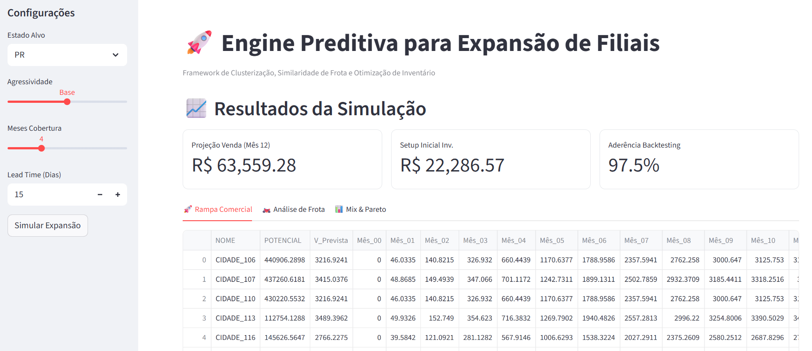

# previsao_vendas
Modelo de previsão de venda para expansões em regiões sem exploração



# 🚀 Expansion Intelligence Engine: Framework Preditivo para Setup de Estoque

Este projeto apresenta um **Framework de Business Intelligence e Ciência de Dados** voltado para a otimização de expansões comerciais e abertura de novas filiais/Centros de Distribuição (CDs). O objetivo central é eliminar o "achismo" no setup inicial de estoque, garantindo disponibilidade de produto sem comprometer o fluxo de caixa.

## 📌 O Problema de Negócio

Um erro comum na expansão de redes varejistas e distribuidoras é dimensionar o estoque inicial de uma nova unidade com base apenas na média de unidades maduras. Isso ignora a **Rampa de Maturação Comercial** da praça e o DNA da frota local (no caso de motopeças/automotivo).

**Riscos mitigados por este modelo:**
* **Imobilização Indevida de Capital:** Compras excessivas de itens de baixo giro.
* **Ruptura de Venda (Stockout):** Falta de itens críticos de Curva A no primeiro mês.
* **Erro de Mix:** Falta de aderência entre o estoque e o perfil de veículos da região.

## 🛠️ Tecnologias Utilizadas

* **Python:** Linguagem core para processamento de dados.
* **Streamlit:** Interface web para o dashboard interativo.
* **Pandas/NumPy:** Manipulação de matrizes e tratamento de dados sintéticos.
* **Scikit-Learn:** Algoritmo K-Means para clusterização e Similaridade de Cosseno.
* **SciPy (Poisson):** Modelagem estatística de probabilidade de demanda.
* **Plotly:** Gráficos interativos (Pareto, Séries Temporais, Sunburst).

## 🧠 Arquitetura do Modelo (Engine Analítica)

O framework opera em três pilares analíticos:

1.  **Mapeamento de Cidades Gêmeas:** Utiliza **Similaridade de Cosseno** para comparar a frota da cidade alvo com cidades onde já temos histórico de venda. Isso permite prever a demanda SKU a SKU mesmo sem histórico local.
2.  **Clusterização K-Means:** Segmentação de municípios por porte e potencial de mercado, definindo padrões de comportamento regional.
3.  **Lógica HUB & Poisson Dinâmico:** O estoque é calculado centralizado no HUB (CD). Aplicamos a **Distribuição de Poisson** sobre a rampa de vendas prevista para definir o estoque de segurança com SLAs variáveis (95% para Curva A, 85% para Curva B e 75% para Curva C).

## 📈 Funcionalidades do Dashboard

* **Rampa Comercial:** Projeção de faturamento mensal para os primeiros 12 meses.
* **Análise de Frota (DNA Local):** Gráfico de Pareto por Cilindrada e Market Share por Montadora.
* **Analítico de Recomendações:** Mix sugerido com indicação de unidades físicas e valor total de investimento (CAPEX).
* **Módulo de Backtesting:** Validação da aderência do modelo (WMAPE) comparando os dados previstos com os realizados.

## 🚀 Como Executar

1.  Certifique-se de ter o Python instalado.
2.  Instale as dependências:
    ```bash
    pip install streamlit pandas numpy plotly scikit-learn scipy
    ```
3.  Execute o dashboard:
    ```bash
    streamlit run Expansion_Intelligence_Engine.py
    ```

## 📂 Estrutura do Código (Versão Sandbox)

A versão disponibilizada neste repositório utiliza um **Gerador de Dados Sintéticos** (Mode Sandbox), permitindo a execução imediata para demonstração das funcionalidades sem a necessidade de conexões com bancos de dados proprietários.

---

**Desenvolvido por Giorgio Morais**
*Consultor Especialista em Ciência de Dados e Gestão Comercial*
